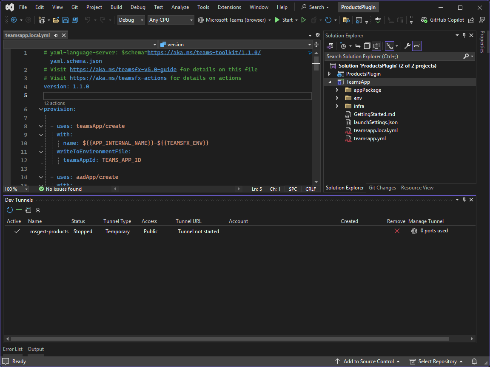

---
lab:
  title: "Exercice\_1\_: créer une extension de message"
  module: 'LAB 01: Connect Copilot for Microsoft 365 to your external data in real-time with message extension plugins built with .NET and Visual Studio'
---

# Exercice 1 : créer une extension de message

Dans cet exercice, vous créez une solution d’extension de message. Vous utilisez Teams Toolkit dans Visual Studio pour créer les ressources requises, puis démarrer une session de débogage et tester dans Microsoft Teams.


### Durée de l’exercice

  - **Durée estimée :** 25 minutes

## Tâche 1 : créer un projet avec Teams Toolkit pour Visual Studio

Commencez par créer un projet d’application Microsoft Teams configuré avec une extension de message qui contient une commande de recherche. Bien que vous puissiez créer un projet à l’aide d’un modèle de projet Teams Toolkit pour Visual Studio, vous devrez apporter des modifications au projet généré pour pouvoir terminer ce module. Au lieu de cela, vous allez utiliser un modèle de projet personnalisé disponible en tant que package NuGet. L’avantage d’utiliser un modèle personnalisé est que celui-ci crée une solution avec les fichiers et les dépendances nécessaires, ce qui vous permet de gagner du temps.

1. Ouvrez une nouvelle session PowerShell en tant qu’administrateur.

1. Définissez un répertoire de travail approprié en exécutant :

    ```Powershell
    cd ~\Documents
    ```

1. Commencez par installer le package de modèle à partir de NuGet en exécutant :

    ```PowerShell
    dotnet new install M365Advocacy.Teams.Templates
    ```

1. Créez un projet en exécutant :

    ```PowerShell
    dotnet new teams-msgext-search --name "ProductsPlugin" `
      --internal-name "msgext-products" `
      --display-name "Contoso products" `
      --short-description "Product look up tool." `
      --full-description "Get real-time product information and share them in a conversation." `
      --command-id "Search" `
      --command-description "Find products by name" `
      --command-title "Products" `
      --parameter-name "ProductName" `
      --parameter-title "Product name" `
      --parameter-description "The name of the product as a keyword" `
      --allow-scripts Yes
    ```

1. Attendez que le projet soit créé.

1. Modifiez le répertoire du projet en exécutant `cd ProductsPlugin`.

1. Ouvrez la solution dans Visual Studio en exécutant `.\ProductsPlugin.sln`.

1. Sélectionnez **Visual Studio 2022** dans la fenêtre de sélection d’applications, puis sélectionnez **Toujours**.

## Tâche 2 : créer un tunnel de développement

Lorsque l’utilisateur interagit avec votre extension de message, le service bot envoie des requêtes au service web. Pendant le développement, votre service web s’exécute localement sur votre ordinateur. Pour permettre au service bot d’atteindre votre service web, vous devez l’exposer au-delà de votre ordinateur à l’aide d’un tunnel de développement.



Continuez dans Visual Studio.

1. Dans la barre d’outils, sélectionnez la liste déroulante à côté du bouton **Démarrer**, développez le menu **Tunnels dev (aucun tunnel actif)** et sélectionnez **Créer un tunnel**.

1. Dans la boîte de dialogue, spécifiez les valeurs suivantes :

    1. **Compte** : connectez-vous à l’aide du compte Microsoft 365 qui vous a été fourni. Sélectionnez **Compte professionnel ou scolaire**.

    1. **Nom** : msgext-products

    1. **Type de tunnel** : temporaire.

    1. **Accès** : public.

1. Créez le tunnel en sélectionnant **OK**. Une invite s’affiche indiquant que le nouveau tunnel est maintenant le tunnel actif.

1. Fermez l’invite en sélectionnant **OK**.

## Tâche 3 : préparer des ressources

Tout étant maintenant en place, utilisez Teams Toolkit et exécutez le processus **Préparer les dépendances de l’application Teams** pour créer les ressources requises.


Le processus Préparer les dépendances de l’application Teams met à jour les variables d’environnement **BOT_ENDPOINT** et **BOT_DOMAIN** dans le fichier **TeamsApp\\env\\.env.local** à l’aide de l’URL du tunnel de développement actif et exécute les actions décrites dans le fichier **TeamsApp\\teamsapp.local.yml**.

Prenez un moment pour explorer les étapes dans le fichier **teamsapp.local.yml**.

Continuez dans Visual Studio.

1. Ouvrez le menu **Projet** (vous pouvez également sélectionner le projet **TeamsApp** dans l’explorateur de solutions), développez le menu **Teams Toolkit** et sélectionnez **Préparer les dépendances de l’application Teams**.

1. Dans la boîte de dialogue **compte Microsoft 365**, connectez-vous ou sélectionnez un compte existant pour accéder à votre locataire Microsoft 365, puis sélectionnez **Continuer**.

1. Dans la boîte de dialogue **Approvisionner**, connectez-vous ou sélectionnez le compte existant à utiliser pour déployer des ressources sur Azure et spécifiez les valeurs suivantes :

      1. **Nom de l’abonnement** : sélectionnez l’abonnement à utiliser dans la liste déroulante.

      1. **Groupe de ressources** : sélectionnez le groupe de ressources prérempli dans la liste déroulante.

1. Créez les ressources dans Azure en sélectionnant **Approvisionner**.

1. Dans l’invite d’avertissement de Teams Toolkit, sélectionnez **Approvisionner**.

1. Dans l’invite d’informations de Teams Toolkit, sélectionnez **Afficher les ressources approvisionnées** pour ouvrir une nouvelle fenêtre de navigateur.

Prenez un moment pour explorer les ressources créées dans Azure et également pour consulter les variables d’environnement créées dans le fichier **.env.local**.

> [!NOTE]
> Si vous fermez et ouvrez à nouveau Visual Studio, l’URL du tunnel de développement sera modifiée et ne sera plus sélectionnée en tant que tunnel actif. Si cela se produit, vous devez sélectionner à nouveau le tunnel et exécuter le processus **Préparer les dépendances de l’application Teams** pour refléter l’URL mise à jour dans le manifeste de l’application.

## Tâche 4 : exécuter et déboguer

Teams Toolkit utilise des profils de lancement à plusieurs projets. Pour exécuter le projet, vous devez activer une fonctionnalité en préversion dans Visual Studio.

Dans Visual Studio :

1. Ouvrez le menu **Outils** et sélectionnez **Options...**.

1. Dans la zone de recherche, saisissez **multi-project**.

1. Dans **Environnement**, sélectionnez **Fonctionnalités en préversion**.

1. Cochez la case située à côté d’**Activer les profils de lancement à plusieurs projets**, puis sélectionnez **OK** pour enregistrer vos modifications.

Pour démarrer une session de débogage et installer l’application dans Microsoft Teams :

1. Appuyez sur <kbd>F5</kbd> ou sélectionnez **Démarrer** dans la barre d’outils.

1. Approuvez ou validez les avertissements de certification SSL éventuels qui s’affichent lorsque vous lancez l’application pour la première fois.

1. Attendez qu’une fenêtre de navigateur s’ouvre et que la boîte de dialogue d’installation de l’application s’affiche dans le client web Microsoft Teams. Lorsque vous y êtes invité, saisissez vos informations d’identification de compte Microsoft 365.

1. Dans la boîte de dialogue d’installation de l’application, sélectionnez **Ajouter**.

Pour tester l’extension de message :

1. Ouvrez une nouvelle conversation (<kbd>Alt+N</kbd>) et commencez à saisir **Contoso** dans la zone **À**, et sélectionnez **Contoso Product Support**.

    > [!NOTE]
    > Cela ne fonctionne pas si vous écrivez à votre propre compte d’utilisateur. Il doit s’agir d’un autre utilisateur ou groupe.

1. Dans la zone de rédaction du message, commencez à taper **/apps** pour ouvrir le sélecteur d’applications.

1. Dans la liste des applications, sélectionnez **Produits Contoso** pour ouvrir l’extension de message.

1. Dans la zone de texte, saisissez **hello**. Vous devrez peut-être saisir votre recherche plusieurs fois.

1. Attendez que les résultats de la recherche s’affichent.

1. Dans la liste des résultats, sélectionnez **hello** pour incorporer une carte dans la zone de rédaction de message.


Revenez à Visual Studio et sélectionnez **Arrêter** dans la barre d’outils ou appuyez sur <kbd>Maj</kbd> + <kbd>F5</kbd> pour arrêter la session de débogage.

[Passez à l’exercice suivant…](./3-exercise-add-single-sign-on.md)