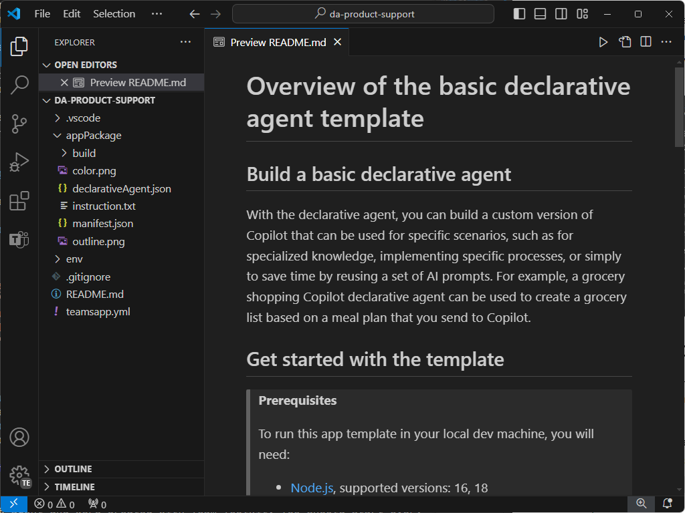
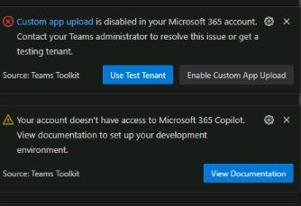

---
lab:
  title: "Exercice\_1\_: créer un agent déclaratif dans Visual Studio Code"
  module: 'LAB 01: Build a declarative agent for Microsoft 365 Copilot using Visual Studio Code'
---

# Exercice 1 : créer un agent déclaratif

Dans cet exercice, vous allez créer un projet d’agent déclaratif à partir d’un modèle, mettre à jour le manifeste, charger l’agent dans Microsoft 365 et tester l’agent dans Microsoft 365 Copilot. 

Un agent déclaratif est implémenté dans une application Microsoft 365. Vous créez un package d’application qui contient :

- app.manifest.json : le fichier manifeste de l’application décrit la configuration de votre application, y compris ses fonctionnalités.
- declarative-agent.json : le manifeste de l’agent déclaratif décrit la configuration de votre agent déclaratif.
- color.png et outline.png : une icône de couleur et de contour utilisée pour représenter votre agent déclaratif dans l’interface utilisateur Microsoft 365 Copilot.

### Durée de l’exercice

- **Durée estimée :** 15 minutes

## Tâche 1 : activer les chargements d’applications personnalisées dans le Centre d’administration Teams

Pour charger des agents déclaratifs dans Microsoft 365 via le kit de ressources Teams, vous devez activer les **chargements d’applications personnalisées** dans le centre d’administration Teams.

1. Accédez aux applications Teams > Stratégies de configuration des applications dans le centre d’administration Teams ou accédez directement aux [Stratégies de configuration d’application](https://admin.teams.microsoft.com/policies/app-setup).
1. Sélectionnez **Global (valeur par défaut à l’échelle de l’organisation)** dans la liste des stratégies.
1. Activez **Charger les applications personnalisées**.
1. Sélectionnez **Enregistrer**, puis **confirmez** votre choix.

## Tâche 2 : télécharger le projet de démarrage

Commencez par télécharger l’exemple de projet à partir de GitHub dans un navigateur web :

1. Naviguez jusqu’au modèle de dépôt [https://github.com/microsoft/learn-declarative-agent-vscode](https://github.com/microsoft/learn-declarative-agent-vscode).
    1. Suivez les étapes pour [télécharger le code source du dépôt](https://docs.github.com/repositories/working-with-files/using-files/downloading-source-code-archives#downloading-source-code-archives-from-the-repository-view) sur votre ordinateur.
    1. Extrayez le contenu du fichier zip téléchargé dans votre **dossier Documents**.

Le projet de démarrage contient un projet Teams Toolkit qui inclut un agent déclaratif.

1. Ouvrez le dossier du projet  dans Visual Studio Code.
1. Dans le dossier racine du projet, ouvrez le fichier **README.md**. Examinez le contenu pour plus d’informations sur la structure du projet.



## Tâche 3 : examiner le manifeste de l’agent déclaratif

Examinons le fichier manifeste de l’agent déclaratif :

- Ouvrez le fichier **appPackage/declarativeAgent.json** et examinez le contenu :

    ```json
    {
        "$schema": "https://aka.ms/json-schemas/agent/declarative-agent/v1.0/schema.json",
        "version": "v1.0",
        "name": "da-product-support",
        "description": "Declarative agent created with Teams Toolkit",
        "instructions": "$[file('instruction.txt')]"
    }
    ```

La valeur de la propriété **instructions** contient une référence à un fichier nommé **instruction.txt**. La fonction **$[file(path)]** est fournie par Teams Toolkit. Le contenu de **instruction.txt** est inclus dans le fichier manifeste de l’agent déclaratif lors de l’approvisionnement dans Microsoft 365.

- Dans le dossier **appPackage**, ouvrez le fichier **instruction.txt** et passez en revue le contenu :

    ```md
    You are a declarative agent and were created with Team Toolkit. You should start every response and answer to the user with "Thanks for using Teams Toolkit to create your declarative agent!\n\n" and then answer the questions and help the user.
    ```

## Tâche 4 : mettre à jour le manifeste de l’agent déclaratif

Nous allons mettre à jour les propriétés **nom** et **description** pour qu’elles soient plus pertinentes pour notre scénario.

1. Dans le dossier **appPackage**, ouvrez le fichier **declarativeAgent.json**.
1. Mettez à jour la valeur de propriété **name** sur **Expert en Microsoft 365**.
1. Mettez à jour la valeur de propriété **description** sur **Expert en Microsoft 365 qui peut répondre à toute question que vous avez sur Microsoft 365**.
1. Enregistrez vos modifications

Le fichier mis à jour doit avoir le contenu suivant :

```json
{
    "$schema": "https://aka.ms/json-schemas/agent/declarative-agent/v1.0/schema.json",
    "version": "v1.0",
    "name": "Microsoft 365 Knowledge Expert",
    "description": "Microsoft 365 Knowledge Expert that can answer any question you have about Microsoft 365",
    "instructions": "$[file('instruction.txt')]"
}
```

## Tâche 5 : charger l’agent déclaratif dans Microsoft 365

Ensuite, chargez votre agent déclaratif sur votre locataire Microsoft 365.

Dans Visual Studio Code :

1. Dans la **barre d’activité**, ouvrez l’extension **Teams Toolkit**.

    

1. Dans la section **Cycle de vie**, sélectionnez **Approvisionner**.

    

1. Dans l’invite, sélectionnez **Connexion** et suivez les invites pour vous connecter à votre locataire Microsoft 365 à l’aide du kit de ressources Teams. Le processus d’approvisionnement démarre automatiquement après la connexion.

    

    

1. Attendez la fin du téléchargement avant de continuer.

    

Ensuite, passez en revue la sortie du processus d’approvisionnement.

- Dans le dossier **appPackage/build**, ouvrez le fichier **declarativeAgent.dev.json**.

Notez que la valeur de la propriété **instructions** contient le contenu du fichier **instruction.txt**. Le fichier **declarativeAgent.dev.json** est inclus dans le fichier **appPackage.dev.zip** ainsi que les fichiers **manifest.dev.json**, **color.png** et **outline.png**. Le fichier **appPackage.dev.zip** est téléchargé dans Microsoft 365.

> [!IMPORTANT]
> Après vous être connecté à votre compte Microsoft 365, vous pouvez voir les avertissements ou messages d’erreur suivants dans Visual Studio Code. Si vous venez d’activer les chargements d’applications personnalisées dans Microsoft Teams, il peut s’écouler un certain temps avec que le paramètre ne prenne effet.  Patientez quelques minutes et réessayez, ou déconnectez-vous et reconnectez-vous avec votre compte Microsoft 365. Le deuxième message concernant l’accès à Microsoft 365 Copilot est attendu, car le locataire n’a pas de licence Copilot complète.
> 
> 

## Tâche 6 : tester l’agent déclaratif dans Microsoft 365 Copilot Chat

Ensuite, nous allons exécuter l’agent déclaratif dans Microsoft 365 Copilot Chat et valider ses fonctionnalités.

1. Dans la **barre d’activité**, ouvrez l’extension **Teams Toolkit**.

    

1. Dans la section **Cycle de vie**, sélectionnez **Publier**. Attendez que les actions soient terminées.

1. Ouvrez Microsoft Edge et accédez à Microsoft 365 Copilot Chat à l’adresse [https://www.microsoft365.com/chat](https://www.microsoft365.com/chat).

1. Dans **Microsoft 365 Copilot**, sélectionnez l’icône en haut à droite pour développer le panneau latéral Copilot. Notez que le panneau affiche les conversations récentes et les agents disponibles.

1. Dans le panneau latéral, sélectionnez **Expert en Microsoft 365** pour entrer dans l’expérience immersive et discuter directement avec l’agent.

1. Demandez à l’agent **Que peux-tu faire ?** et envoyez l’invite.

    

Passez à l’exercice suivant.