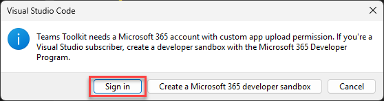
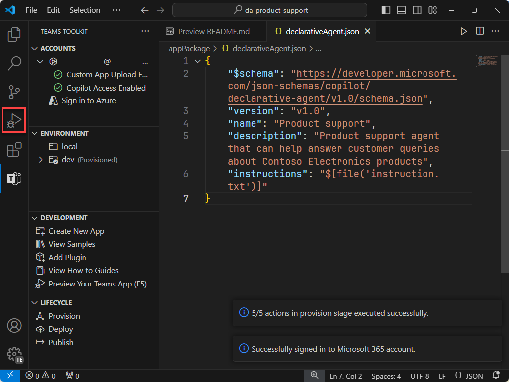
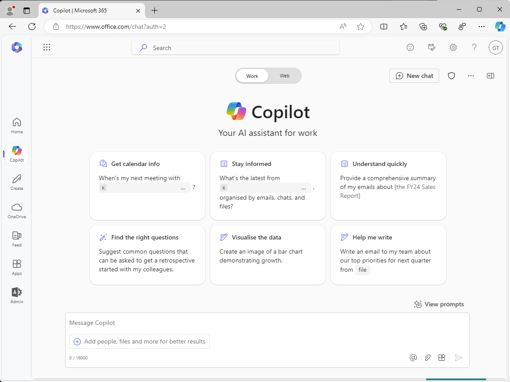
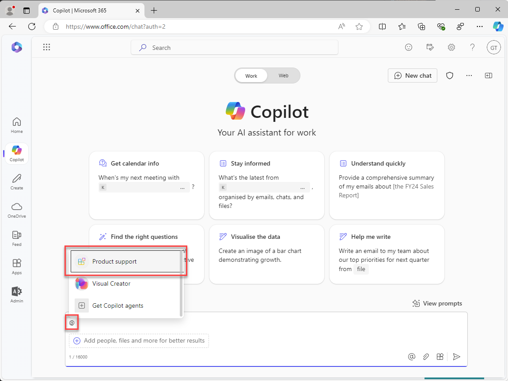
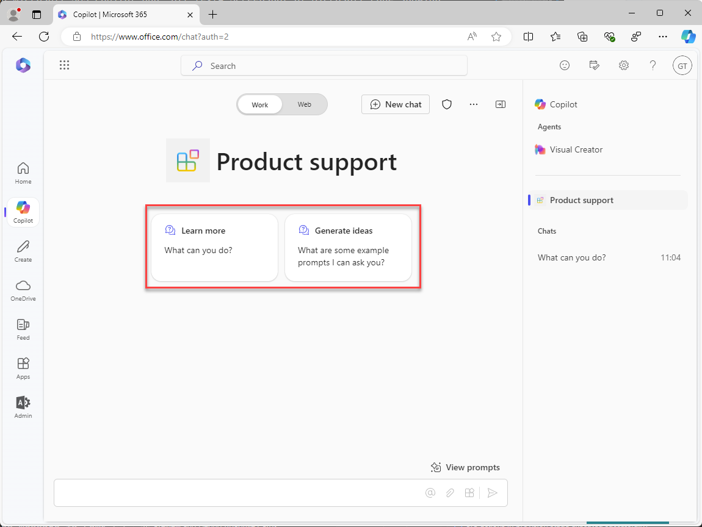
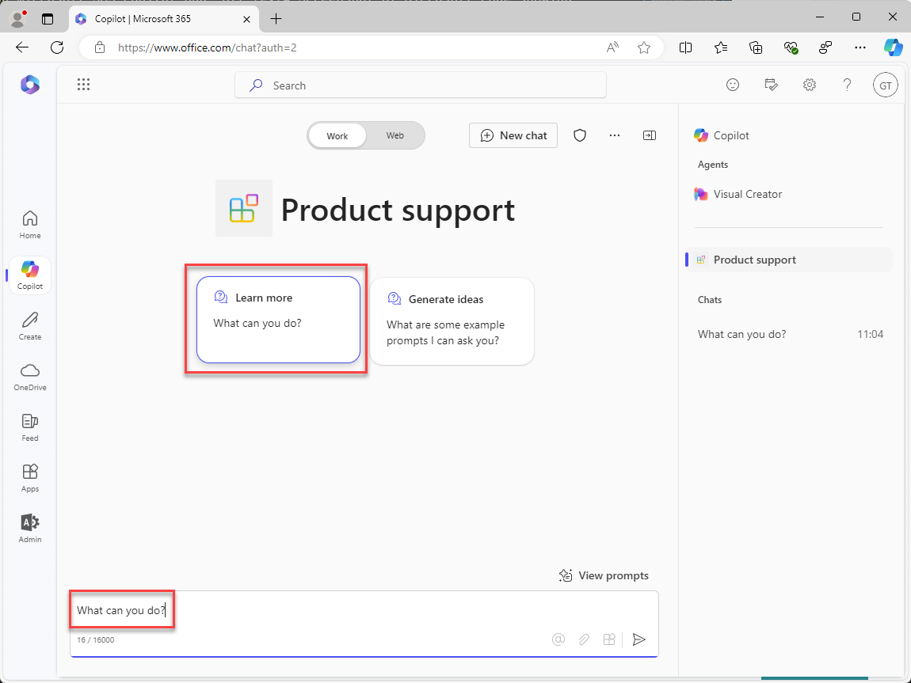

---
lab:
  title: "Exercice\_1\_: créer un agent déclaratif dans Visual Studio Code"
  module: 'LAB 01: Build a declarative agent for Microsoft 365 Copilot using Visual Studio Code'
---

# Exercice 1 : créer un agent déclaratif

Dans cet exercice, vous allez créer un projet d’agent déclaratif à partir d’un modèle, mettre à jour le manifeste, charger l’agent dans Microsoft 365 et tester l’agent dans Microsoft 365 Copilot. 

Un agent déclaratif est implémenté dans une application Microsoft 365. Vous créez un package d’application qui contient :

- app.manifest.json : le fichier manifeste de l’application décrit la configuration de votre application, y compris ses fonctionnalités.
- declarative-agent.json : le manifeste de l’agent déclaratif décrit la configuration de votre agent déclaratif.
- color.png et outline.png : une icône de couleur et de contour utilisée pour représenter votre agent déclaratif dans l’interface utilisateur Microsoft 365 Copilot.

### Durée de l’exercice

- **Durée estimée :** 15 minutes

## Tâche 1: télécharger le projet de démarrage

Commencez par télécharger l’exemple de projet à partir de GitHub dans un navigateur web :

1. Naviguez jusqu’au modèle de dépôt [https://github.com/microsoft/learn-declarative-agent-vscode](https://github.com/microsoft/learn-declarative-agent-vscode).
    1. Suivez les étapes pour [télécharger le code source du dépôt](https://docs.github.com/repositories/working-with-files/using-files/downloading-source-code-archives#downloading-source-code-archives-from-the-repository-view) sur votre ordinateur.
    1. Extrayez le contenu du fichier zip téléchargé dans votre **dossier Documents**.

Le projet de démarrage contient un projet Teams Toolkit qui inclut un agent déclaratif.

1. Ouvrez le dossier du projet  dans Visual Studio Code.
1. Dans le dossier racine du projet, ouvrez le fichier **README.md**. Examinez le contenu pour plus d’informations sur la structure du projet.


## Tâche 2 : examiner le manifeste de l’agent déclaratif

Examinons le fichier manifeste de l’agent déclaratif :

- Ouvrez le fichier **appPackage/declarativeAgent.json** et examinez le contenu :

    ```json
    {
        "$schema": "https://aka.ms/json-schemas/agent/declarative-agent/v1.0/schema.json",
        "version": "v1.0",
        "name": "da-product-support",
        "description": "Declarative agent created with Teams Toolkit",
        "instructions": "$[file('instruction.txt')]"
    }
    ```

La valeur de la propriété **instructions** contient une référence à un fichier nommé **instruction.txt**. La fonction **$[file(path)]** est fournie par Teams Toolkit. Le contenu de **instruction.txt** est inclus dans le fichier manifeste de l’agent déclaratif lors de l’approvisionnement dans Microsoft 365.

- Dans le dossier **appPackage**, ouvrez le fichier **instruction.txt** et passez en revue le contenu :

    ```md
    You are a declarative agent and were created with Team Toolkit. You should start every response and answer to the user with "Thanks for using Teams Toolkit to create your declarative agent!\n\n" and then answer the questions and help the user.
    ```

## Tâche 3 : mettre à jour le manifeste de l’agent déclaratif

Nous allons mettre à jour les propriétés **nom** et **description** pour qu’elles soient plus pertinentes pour notre scénario.

1. Dans le dossier **appPackage**, ouvrez le fichier **declarativeAgent.json**.
1. Mettez à jour la valeur de la propriété **nom** en **Support technique**.
1. Mettez à jour la valeur de la propriété **description** en **Agent de support technique qui peut aider à répondre aux requêtes des clients sur les produits Contoso Electronics**.
1. Enregistrez vos modifications

Le fichier mis à jour doit avoir le contenu suivant :

```json
{
    "$schema": "https://aka.ms/json-schemas/agent/declarative-agent/v1.0/schema.json",
    "version": "v1.0",
    "name": "Product support",
    "description": "Product support agent that can help answer customer queries about Contoso Electronics products",
    "instructions": "$[file('instruction.txt')]"
}
```

## Tâche 4 : charger l’agent déclaratif dans Microsoft 365

> [!IMPORTANT]
> Avant de commencer, vérifiez que l’extension Teams Toolkit est installée dans Visual Studio Code. Si vous n’avez pas déjà installé l’extension à partir de la Place de marché, faites-le maintenant.

Ensuite, chargez votre agent déclaratif sur votre locataire Microsoft 365.

Dans Visual Studio Code :

1. Dans la **barre d’activité**, ouvrez l’extension **Teams Toolkit**.

    

1. Dans la section **Cycle de vie**, sélectionnez **Approvisionner**.

    

1. Dans l’invite, sélectionnez **Connexion** et suivez les invites pour vous connecter à votre locataire Microsoft 365 à l’aide du kit de ressources Teams. Le processus d’approvisionnement démarre automatiquement après la connexion.

    

    

1. Attendez la fin du téléchargement avant de continuer.

    

Ensuite, passez en revue la sortie du processus d’approvisionnement.

- Dans le dossier **appPackage/build**, ouvrez le fichier **declarativeAgent.dev.json**.

Notez que la valeur de la propriété **instructions** contient le contenu du fichier **instruction.txt**. Le fichier **declarativeAgent.dev.json** est inclus dans le fichier **appPackage.dev.zip** ainsi que les fichiers **manifest.dev.json**, **color.png** et **outline.png**. Le fichier **appPackage.dev.zip** est téléchargé dans Microsoft 365.

## Tâche 5 : tester l’agent déclaratif dans Microsoft 365 Copilot

Ensuite, nous allons exécuter l’agent déclaratif dans Microsoft 365 Copilot et valider ses fonctionnalités dans les expériences **contextuelle** et **immersives**.

Dans Visual Studio Code :

1. Dans la **barre d’activité**, basculez vers la vue **Exécuter et Déboguer**.

    

1. Sélectionnez le bouton **Démarrer le débogage** en regard de la liste déroulante de la configuration, ou appuyez sur <kbd>F5</kbd>. Une nouvelle fenêtre de navigateur s’ouvre et accède à Microsoft 365 Copilot.

    

    

    

Continuons dans le navigateur et testons l’expérience **contextuelle**.

1. Dans **Microsoft 365 Copilot**, entrez le symbole <kbd>@</kbd> dans la zone de message. Le menu volant s’affiche avec une liste des agents disponibles.

    

1. Dans le menu volant, sélectionnez **Support technique**. Notez le message d’état au-dessus de la zone de message. Il affiche **Conversation avec le support technique**, ce qui signifie que vous utilisez l’expérience contextuelle de l’agent.

    

1. Dans la zone de texte, entrez **Que pouvez-vous faire ?** et envoyez votre message.

    

1. Attendez la réponse. Notez comment la réponse commence par le texte « Merci d’utiliser Teams Toolkit pour créer votre agent déclaratif ! » tel que défini dans les instructions que vous avez passées en revue précédemment.

    

1. Pour quitter l’expérience contextuelle, sélectionnez la croix (X) dans le message d’état. Notez que le message d’état est supprimé et qu’un message s’affiche dans la fenêtre de conversation qui indique que vous ne discutez plus avec l’agent.

    

    

Enfin, testons l’expérience **immersive**.

Continuez dans le navigateur :

1. Dans **Microsoft 365 Copilot**, sélectionnez l’icône en haut à droite pour développer le panneau latéral Copilot. Notez que le panneau affiche les conversations récentes et les agents disponibles.

    

1. Dans le volet latéral, sélectionnez **Support technique** pour entrer dans l’expérience immersive et discuter directement avec l’agent. Notez deux exemples d’invites affichés dans l’interface.

    

1. Sélectionnez l’exemple d’invite avec le titre **En savoir plus**. Notez que le texte **Que pouvez-vous faire ?** est ajouté à la zone de message pour vous.

    

1. Envoyez le message et attendez la réponse. Notez comment la réponse commence par le texte « Merci d’utiliser Teams Toolkit pour créer votre agent déclaratif ! » tel que défini dans les instructions que vous avez passées en revue précédemment.

    

Enfin, fermez le navigateur pour arrêter la session de débogage dans Visual Studio Code.