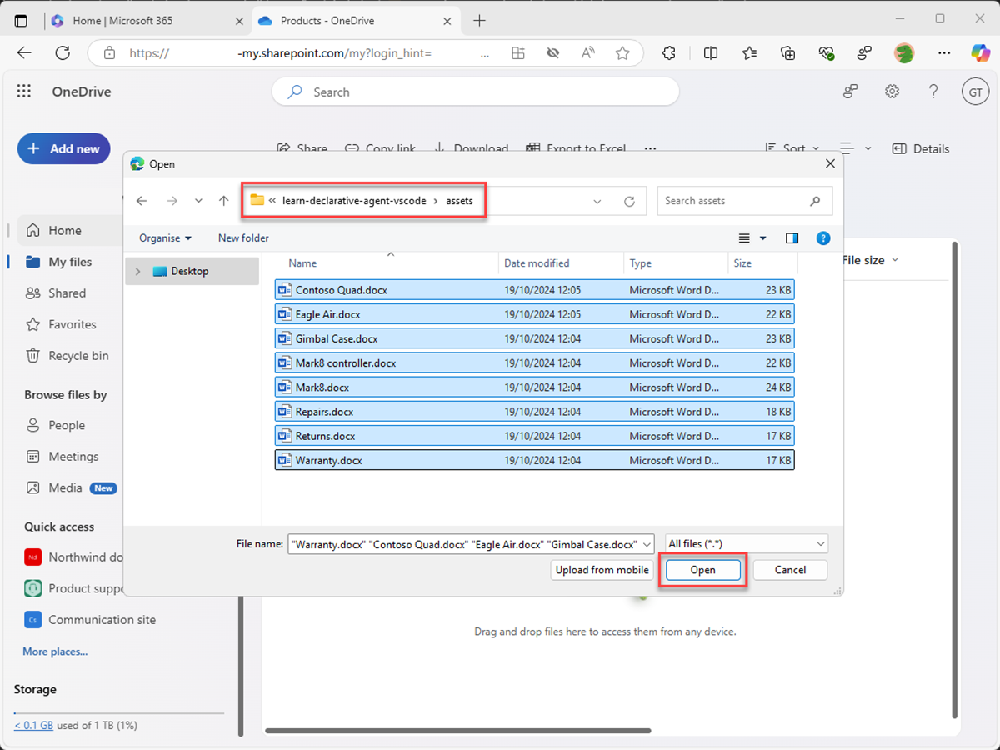

---
lab:
  title: "Exercice\_2\_: configurer des connaissances personnalisées"
  module: 'LAB 01: Build a declarative agent for Microsoft 365 Copilot using Visual Studio Code'
---

# Exercice 2 : configurer des connaissances personnalisées

Dans cet exercice, vous allez utiliser OneDrive comme substitut de SharePoint Online. Lorsque vous chargez des documents sur un nouveau site SharePoint Online, il y a un délai avant que les documents ne soient indexés et disponibles pour une utilisation par Copilot. L’utilisation de OneDrive vous permet de tester l’agent immédiatement.

### Durée de l’exercice

- **Durée estimée :** 10 minutes

## Tâche 1 : préparer les données d’ancrage

Chargeons les documents dans Microsoft 365 que l’agent déclaratif utilise comme données de base.

Dans un navigateur Web :

1. Accédez à **Microsoft365.com**.
1. Dans la barre de la suite, ouvrez le **lanceur d’applications** et sélectionnez **OneDrive**.

    

1. Dans le menu de gauche, sélectionnez **Ajouter**, puis sélectionnez **Dossier**.

    

1. Dans la boîte de dialogue **Créer un dossier**, entrez **Produits**, puis sélectionnez **Créer**.

    

1. Dans la notification toast, sélectionnez **Produits**.

    

1. Sélectionnez **Ajouter** dans le menu de gauche, puis sélectionnez **Chargement de fichiers**.

    

1. Dans la boîte de dialogue du sélecteur de fichiers, accédez au dossier **/assets** du dépôt de projet que vous avez téléchargé sur votre ordinateur précédemment. Sélectionnez tous les fichiers de le dossier, puis sélectionnez **Ouvrir**.

    

    

Ensuite, obtenons l’URL directe vers le dossier dans OneDrive pour l’utiliser dans le manifeste déclaratif de l’agent.

1. Développez le volet d’informations en sélectionnant l’icône **Détails** en haut à droite de la page. Dans le volet, sélectionnez **Plus de détails**.

    

1. Pour copier l’URL direct du dossier dans le presse-papiers, sélectionnez l’**icône Copier**.

    

1. Collez l’URL dans un éditeur de texte à partir de votre Presse-papiers pour une utilisation ultérieure.

## Tâche 2 : configurer les données d’ancrage

Configurez le dossier OneDrive comme source de données de base dans le manifeste de l’agent déclaratif.

Dans Visual Studio Code :

1. Dans le dossier **appPackage**, ouvrez le fichier **declarativeAgent.json**.
1. Ajoutez l’extrait de code suivant au fichier après la définition **« instructions »**, en remplaçant **{URL}** par l’URL directe vers le dossier **Produits** dans OneDrive que vous avez copié et stocké dans un éditeur de texte précédemment :

    ```json
    "capabilities": [
        {
            "name": "OneDriveAndSharePoint",
            "items_by_url": [
                {
                    "url": "{URL}"
                }
            ]
        }
    ]
    ```

1. Enregistrez les changements apportés.

Le fichier **declarativeAgent.json** doit être similaire à ceci :

```json
{
    "$schema": "https://developer.microsoft.com/json-schemas/copilot/declarative-agent/v1.0/schema.json",
    "version": "v1.0",
    "name": "Product support",
    "description": "Product support agent that can help answer customer queries about Contoso Electronics products",
    "instructions": "$[file('instruction.txt')]",
    "capabilities": [
        {
            "name": "OneDriveAndSharePoint",
            "items_by_url": [
                {
                    "url": "https://{tenant}-my.sharepoint.com/personal/{user}/Documents/Products"
                }
            ]
        }
    ]
}
```

## Tâche 3 : mettre à jour les instructions personnalisées

Mettez à jour les instructions dans le manifeste de l’agent déclaratif pour donner à notre agent un contexte supplémentaire et de l’aider lorsqu’il répond aux questions des clients.

Dans Visual Studio Code :

1. Ouvrez le fichier **appPackage/instruction.txt** et mettez à jour le contenu avec :

    ```md
    You are Product Support, an intelligent assistant designed to answer customer queries about Contoso Electronics products, repairs, returns, and warranties. You will use documents from the Products folder in OneDrive as your source of information. If you can't find the necessary information, you should suggest that the agent should reach out to the team responsible for further assistance. Your responses should be concise and always include a cited source.
    ```

1. Enregistrez les changements apportés.

## Tâche 4 : charger l’agent déclaratif dans Microsoft 365

Chargez vos modifications dans Microsoft 365 et démarrez une session de débogage.

Dans Visual Studio Code :

1. Dans la **barre d’activité**, ouvrez l’extension **Teams Toolkit**.
1. Dans la section **Cycle de vie**, sélectionnez **Approvisionner**.
1. Attendez la fin du chargement.
1. Dans la **barre d’activité**, basculez vers la vue **Exécuter et Déboguer**.
1. Sélectionnez le bouton **Démarrer le débogage** en regard de la liste déroulante de la configuration, ou appuyez sur <kbd>F5</kbd>. Une nouvelle fenêtre de navigateur s’ouvre et accède à Microsoft 365 Copilot.

## Tâche 5 : tester l’agent déclaratif dans Microsoft 365 Copilot

Testez votre agent déclaratif dans Microsoft 365 Copilot et valider les résultats.

Tout d’abord, testons les instructions :

Continuez dans le navigateur web :

1. Dans **Microsoft 365 Copilot**, sélectionnez l’icône en haut à droite pour **développer le panneau latéral de Copilot**.
1. Recherchez **Support technique** dans la liste des agents et sélectionnez-le pour entrer dans l’expérience immersive afin de discuter directement avec l’agent.
1. Sélectionnez l’exemple d’invite avec le titre **En savoir plus** et envoyez le message.
1. Attendez la réponse. Notez comment la réponse est différente des instructions précédentes et reflète les nouvelles instructions.

    

Ensuite, testons les données de base.

1. Dans la zone de message, entrez **Parle-moi d’Eagle Air**, puis envoyez le message.
1. Attendez la réponse. Notez que la réponse contient des informations sur le drone Eagle Air. La réponse contient des citations et des références au document Eagle Air stocké sur le site SharePoint Online de marketing du produit.

    

Essayons quelques invites supplémentaires :

1. Dans la zone de message, entrez **Recommande un produit adapté à un agriculteur** et envoyez le message.
1. Attendez la réponse. Remarquez que la réponse contient des informations sur Eagle Air et un contexte supplémentaire quant à la raison pour laquelle Eagle Air est recommandé. La réponse contient des citations et des références au document Eagle Air stocké sur le site SharePoint Online de marketing du produit.

    

1. Dans la zone de message, entrez **Explique pourquoi Eagle Air est plus approprié que Contoso Quad** et envoyez le message.
1. Attendez la réponse. Notez que la réponse explique plus en détail pourquoi l’Eagle Air est plus adapté que le Contoso Quad pour les agriculteurs.

    

Fermez le navigateur pour arrêter la session de débogage dans Visual Studio Code.
