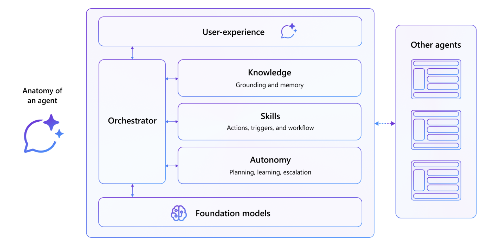

---
lab:
  title: Présentation
  module: 'LAB 02: Build your first action for declarative agents with API plugin by using Visual Studio Code'
---

# Présentation

Les agents Microsoft 365 Copilot vous permettent de créer des assistants basés sur l’intelligence artificielle optimisés pour des scénarios spécifiques. À l’aide d’instructions, vous définissez le contexte de l’agent et spécifiez des paramètres tels que le ton de la voix ou la façon dont il doit répondre. En configurant les compétences de l’agent, vous lui donnez la possibilité d’interagir avec des systèmes externes, de déclencher certains comportements en fonction des conditions du système ou d’utiliser une logique de flux de travail personnalisée. Les actions qui permettent à un agent déclaratif de communiquer avec des API pour récupérer et modifier des données constituent un type de compétence.

## Exemple de scénario

Supposons que vous travaillez dans une organisation, où vous commandez régulièrement à manger dans un restaurant local. Le restaurant travaille avec un menu quotidien qu’il publie sur Internet. Vous voulez être en mesure de voir rapidement quels sont les plats disponibles, mais aussi prendre en compte les allergènes au cas où vous auriez des invités. Le restaurant expose son menu via une API. Au lieu de créer une application distincte, vous souhaitez intégrer les informations dans Microsoft 365 Copilot afin que vous puissiez facilement trouver les plats disponibles que vous pouvez commander et leurs ingrédients. Vous souhaitez utiliser le langage naturel pour parcourir le menu et passer des commandes.

## Qu’allez-vous faire ?

Dans ce module, vous créez une action pour un agent déclaratif avec un plug-in d’API. L’action permet à l’agent d’interagir avec un système externe à l’aide de son API anonyme. Vous allez découvrir comment effectuer les actions suivantes :

- **Créer** : créez un plug-in d’API qui se connecte à une API anonyme.
- **Configurer** : configurez le plug-in d’API pour afficher les données de l’API.
- **Étendre** : étendez un agent déclaratif avec une action à l’aide d’un plug-in d’API.
- **Approvisionner** : chargez votre agent déclaratif sur Microsoft 365 Copilot et validez les résultats.

## Durée du labo

- **Durée estimée :** 35 minutes

## Objectifs d’apprentissage

À la fin de ce module, vous savez comment intégrer des agents déclaratifs avec des plug-ins d’API connectés à des API anonymes, pour leur permettre d’interagir avec des systèmes externes en temps réel.