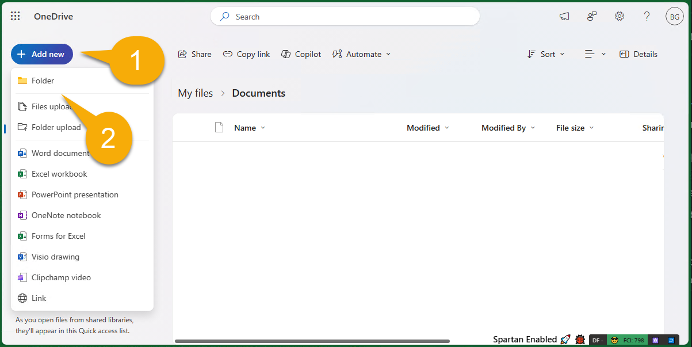

---
lab:
  title: Préparer votre environnement de développement
  module: 'LAB 02: Build your own message extension plugin with TypeScript (TS) for Microsoft Copilot'
---

# Préparer votre environnement de développement

Préparons tout d’abord votre environnement de développement, vos comptes et vos logiciels. Avant de commencer, vous devez effectuer les tâches suivantes.

## Tâche 1 - Installer les prérequis

> [!IMPORTANT]
> Pour mener ce projet à bien, vous aurez besoin d’un compte Microsoft 365 avec l’autorisation de charger des applications. Pour effectuer l’**Exercice 2**, le compte doit également être concédé sous licence pour Microsoft Copilot pour Microsoft 365.

Si vous utilisez un nouveau locataire, il est judicieux de vous connecter à la [page de Microsoft 365](https://office.com) à l’adresse [https://office.com](https://office.com) avant de commencer. Selon la configuration du locataire, vous pouvez être invité à configurer l’authentification multifacteur. Vérifiez que vous avez accès à Microsoft Teams et à Microsoft Outlook avant de continuer.

Les outils suivants ont déjà été installés dans le labo sur **MS-4010-CLIENT01**. Vérifiez qu’ils sont installés et fonctionnels :

1. [Visual Studio Code](https://code.visualstudio.com/) (dernière version)

1. [Explorateur Stockage Azure](https://azure.microsoft.com/products/storage/storage-explorer/) : téléchargez-le si vous souhaitez afficher et modifier la base de données Northwind utilisée dans cet exemple.

<!--## Task 2 - Install nvm-windows

You'll use this tool to install Node.js and optionally switch Node versions as needed for your projects.

1. In a web browser, navigate to [https://github.com/coreybutler/nvm-windows/releases](https://github.com/coreybutler/nvm-windows/releases).
2. Locate the latest release version and select the **nvm-setup.zip** file to download.  The file will be downloaded to your machine.
3. Open the file folder and **extract** the contents of the zip folder to a folder on your machine.
4. From the new folder, select **nvm-setup.exe** to open the setup file.
5. Follow the prompts in the installer to install the tool using the default options.
6. Nvm for Windows will be installed on your machine.

## Task 3 - Install Node.js

Install Node.js version 18.18.2, which is compatible with all of the solutions in this course.

1. Open the **Command Prompt** application.
2. Enter the command `nvm install 18.18` to install Node.js.
3. The nvm output should confirm that installation is complete.
4. Run the command `nvm use 18.18` to use this version of Node.js.
5. Run the command `node -v` to confirm that you have version 18.18.2 installed.

You have now installed and configured Node.js version 18.18.2-->

## Tâche 2 - Télécharger l’exemple de code

[Téléchargez](https://github.com/OfficeDev/Copilot-for-M365-Plugins-Samples/) l’exemple de référentiel en tant que fichier ZIP et extrayez-le dans votre dossier **Documents** :

```text
https://github.com/OfficeDev/Copilot-for-M365-Plugins-Samples/
```

Dans le référentiel, accédez au dossier **samples/msgext-northwind-inventory-ts**. Ces labos y font référence comme votre « **dossier de travail** », car c’est là que vous allez travailler.

## Tâche 3 - Copier des exemples de documents dans OneDrive

L’exemple d’application inclut certains documents auxquels Copilot doit se référer pendant les labos. Dans cette tâche, vous allez copier ces fichiers dans le OneDrive de votre utilisateur afin que Copilot puisse les trouver. Selon la configuration du locataire, vous pouvez être invité à configurer l’authentification multifacteur dans le cadre de ce processus.

1. Ouvrez votre navigateur web et accédez à Microsoft 365 ([https://www.office.com/](https://www.office.com/)). Connectez-vous à l’aide du compte Microsoft 365 que vous utiliserez tout au long du labo. Vous pouvez être invité à configurer l’authentification multifacteur.

1. À l’aide du menu des applications dans le coin supérieur gauche de la page 1️⃣, accédez à l’application OneDrive dans Microsoft 365 2️⃣.

    

1. Dans OneDrive, accédez à **Mes fichiers** 1️⃣. Si un dossier de documents existe, accédez-y également. Si ce n’est pas le cas, vous pouvez travailler directement dans l’emplacement **Mes fichiers**.

    

1. Sélectionnez maintenant **Ajouter nouveau** 1️ et **Dossier** 2️⃣ pour créer un dossier.

    

1. Nommez le dossier **Northwind contracts** et sélectionnez **Créer**.

    

1. À présent, dans ce nouveau dossier, sélectionnez à nouveau **Ajouter nouveau 1️** mais sélectionnez **Chargement de fichiers** 2️ cette fois-ci.

    

1. Accédez maintenant au dossier **sampleDocs** dans votre **dossier de travail**. Mettez en surbrillance tous les fichiers 1️⃣ et sélectionnez **OK** 2️⃣ pour tous les charger.

    

En anticipant cette tâche, il y a de grandes chances que moteur de recherche Microsoft 365 les aura découverts lorsque vous serez prêts à les utiliser.

## Tâche 4 : configurer le Teams Toolkit pour Visual Studio Code

Dans cette tâche, vous allez installer la version actuelle de [Teams Toolkit pour Visual Studio Code](https://learn.microsoft.com/microsoftteams/platform/toolkit/teams-toolkit-fundamentals?pivots=visual-studio-code-v5). La méthode la plus simple consiste à le faire à partir de Visual Studio Code.

1. Ouvrez votre **dossier de travail** dans Visual Studio Code. Vous pouvez être invité à approuver les auteurs de ce dossier. Si c’est le cas, faites-le. Dans le **menu Fichier de Visual Studio Code**, sélectionnez **Ouvrir le dossier** et ouvrez directement le dossier **msgext-northwind-inventory-ts**.

1. Sélectionnez maintenant l’icône de **Teams Toolkit** à gauche 1️⃣. Si des options de création de projet sont proposées, vous êtes probablement dans le mauvais dossier.  Vous devez voir les sections des comptes, de l’environnement, etc. comme indiqué ci-dessous.

1. Sous **Comptes**, sélectionnez **Se connecter à Microsoft 365** 2️⃣ et connectez-vous avec votre compte Microsoft 365.

    

1. Une fenêtre de navigateur s’ouvre et propose de se connecter à Microsoft 365. Lorsqu’il affiche **Vous êtes maintenant connecté, fermez cette page**, faites-le.

1. Enfin, vérifiez qu’une coche verte apparaît en regard de **Chargement d’une application personnalisée activé**. Si ce n’est pas le cas, cela signifie que votre compte d’utilisateur n’est pas autorisé à charger des applications Teams. Cette autorisation est « désactivée » par défaut. Vous trouverez ici des [instructions pour permettre aux utilisateurs de charger des applications personnalisées](https://learn.microsoft.com/microsoftteams/teams-custom-app-policies-and-settings#allow-users-to-upload-custom-apps).

    

## Vérifier votre travail

Après avoir effectué toutes les tâches ci-dessus, vous devez avoir installé et téléchargé les éléments suivants sur votre ordinateur :

- [Visual Studio Code](https://code.visualstudio.com/) (dernière version)

- [Node.js version 18.x](https://nodejs.org/download/release/v18.18.2/)

- [Explorateur Stockage Azure (facultatif)](https://azure.microsoft.com/products/storage/storage-explorer/)

- [Teams Toolkit pour Visual Studio Code](https://learn.microsoft.com/microsoftteams/platform/toolkit/teams-toolkit-fundamentals?pivots=visual-studio-code-v5)

- Exemple de référentiel : [https://github.com/OfficeDev/Copilot-for-M365-Plugins-Samples/](https://github.com/OfficeDev/Copilot-for-M365-Plugins-Samples/)

Si tout a été préparé correctement, vous êtes maintenant prêt à exécuter l’exemple d’application en tant qu’extension de message. 

[Passez à l’exercice suivant…](./3-exercise-1-run-message-extension.md)