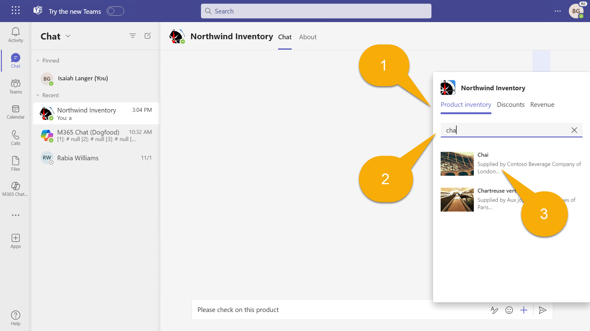
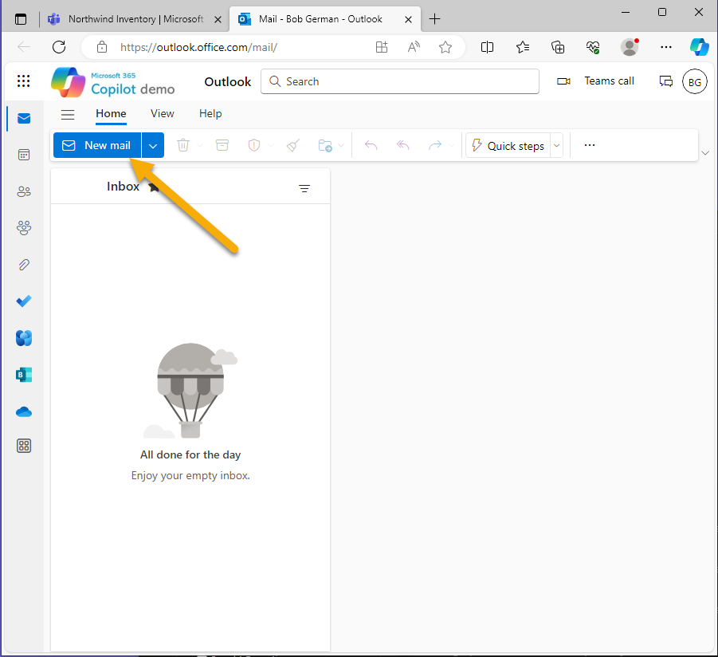

---
lab:
  title: "Exercice\_1\_: exécuter l’exemple en tant qu’extension de message"
  module: 'LAB 02: Build your own message extension plugin with TypeScript (TS) for Microsoft 365 Copilot'
---

# Exercice 1 : exécuter l’exemple en tant qu’extension de message

Dans cet exercice, vous allez exécuter l’application en tant que plug-in pour Teams et Outlook. Vous allez expérimenter différentes invites et vous observerez comment le plug-in est appelé à l’aide de différents paramètres.

## Tâche 1 : configurer le projet pour la première utilisation

Dans ce projet, la base de données Northwind est stockée dans Stockage Table Azure. Lorsque vous effectuez un débogage local, vous utilisez l’émulateur de stockage [Azurite](https://learn.microsoft.com/azure/storage/common/storage-use-azurite?tabs=visual-studio). Il est essentiellement intégré au projet, mais le projet ne sera pas généré, sauf si vous fournissez le chaîne de connexion.

Teams Toolkit stocke les variables d’environnement dans le dossier **env**, et il renseigne automatiquement toutes les valeurs lorsque vous démarrez votre projet la première fois. Toutefois, il existe une valeur spécifique à l’exemple d’application, c’est la chaîne de connexion pour accéder à la base de données Northwind. Le paramètre nécessaire est fourni dans un fichier **env/.env.local.user.sample**. 

Faites une copie de ce fichier dans le dossier **env** et nommez-le **.env.local.user**. C’est là que les paramètres secrets ou sensibles sont stockés.

Si vous ne savez pas comment procéder dans Visual Studio Code : 

1. Développez le dossier **env** et cliquez avec le bouton droit sur **.env.local.user.sample**. Sélectionnez **Copier**. 

1. Cliquez ensuite avec le bouton droit n’importe où dans le dossier **env**, puis sélectionnez **Coller**. Vous aurez ainsi un nouveau fichier nommé **.env.local.user copy.sample**. 

1. Utilisez le même menu contextuel pour renommer le fichier en **.env.local.user** et vous avez terminé.

    

Le fichier **.env.local.user** résultant doit contenir cette ligne :

```console
SECRET_BOT_PASSWORD=
SECRET_STORAGE_ACCOUNT_CONNECTION_STRING=UseDevelopmentStorage=true
```

## Tâche 2 : exécuter l’application localement

1. Dans Visual Studio Code, appuyez sur **F5**avec le **dossier de travail** ouvert pour démarrer le débogage, ou sélectionnez le bouton de démarrage 1️⃣.

1. Sélectionnez **Déboguer dans Teams (Edge)** 2️⃣.

    

    La première fois que votre application s’exécute, vous pouvez être invité à autoriser NodeJS à accéder à votre pare-feu ; cela est nécessaire pour permettre à l’application de communiquer.

    Cela peut prendre un certain temps lors du premier chargement de tous les packages NPM. Une fenêtre de navigateur s’ouvre et vous invite à vous connecter.

    

    Une fois connecté, Microsoft Teams doit ouvrir et afficher une boîte de dialogue pour installer votre application. Observez les informations affichées (qui sont dérivées du **manifeste de l’application**).

1. Sélectionnez **Ajouter** pour ajouter Northwind Inventory en tant qu’application personnelle.

    

> [!NOTE]
> Si vous voyez cet écran, vous devez corriger votre fichier **env/.env.local.user**. Ceci est expliqué dans la tâche précédente.
>
> 

Vous serez dirigé vers une conversation au sein de l’application, mais vous pouvez utiliser l’application dans n’importe quelle conversation.

## Tâche 3 : tester dans Microsoft Teams

1. Dans la **conversation Northwind Inventory**, commencez à saisir un message 1️⃣ qui fait référence à un produit. Ensuite, pour insérer une carte adaptative pour le produit, sélectionnez **+** 2️⃣. 

1. Dans le panneau volant, sélectionnez l’application **Northwind Inventory** que vous venez d’installer 3️⃣.

    

  Vous pouvez voir une boîte de dialogue de recherche avec 2 onglets 1️⃣. L’onglet **Inventaire des produits** permet de rechercher des produits par nom.

1. Saisissez un nom de produit ou le début d’un nom de produit tel que **chai** dans la zone de recherche 2️⃣. Si vous faites une pause lorsque vous tapez les premières lettres, vous verrez plus de choix de produits commençant par les mêmes caractères.

1. Sélectionnez **Chai** 3️⃣ pour insérer une carte adaptative dans la conversation avec votre commentaire.

    

1. Vous pouvez voir la carte, mais vous ne pouvez pas l’utiliser tant que vous ne l’avez pas envoyée. Apportez toutes les modifications finales à votre message, puis sélectionnez **Envoyer**. Notez qu’il n’y a pas de chai en commande 1️⃣. Il y a certainement de nombreux amateurs de thé chai et ils pourraient arriver donc mieux vaut en commander plus ! 

    

    > [!NOTE]
    > Les actions de la carte adaptative ne fonctionnent pas tant que vous n’avez pas envoyé la carte. Si vous recevez une erreur, vérifiez que vous avez envoyé le message et que vous utilisez la carte une fois qu’elle a été envoyée.

1. Sélectionnez le bouton 2️⃣ **Effectuer une action** pour ouvrir une carte enfant. Saisissez une quantité 3️⃣ et sélectionnez le bouton **Réapprovisionner**. La carte s’actualise avec un message de réussite et un nombre d’unités en commande mis à jour.

    

Vous pouvez annuler la commande ou modifier les niveaux de stock à l’aide des deux autres boutons.

## Tâche 4 : requêtes avancées

De retour dans Visual Studio Code, ouvrez le fichier manifeste de l’application nommé **manifest.json** dans le répertoire **appPackage**. Vous remarquerez que les informations d’application affichées lorsque vous avez installé l’application sont toutes ici. Faites défiler vers le bas et recherchez `composeExtensions:`. 

```json
"composeExtensions": [
    {
        "botId": "${{BOT_ID}}",
        "commands": [
            {
                "id": "inventorySearch",
                ...
                "description": "Search products by name, category, inventory status, supplier location, stock level",
                "title": "Product inventory",
                "type": "query",
                "parameters": [ ... ]
            },
            {
                "id": "discountSearch",
                ...
                "description": "Search for discounted products by category",
                "title": "Discounts",
                "type": "query",
                "parameters": [ ...]
            }
        ]
    }
],
```

> [!NOTE]
> Les extensions de message s’appelaient avant « extensions de rédaction ». L’extension de message Northwind Inventory est définie ici.

Tout d’abord, notez l’**ID de bot** approvisionné par Microsoft Teams, qui utilise le canal de bot Azure pour échanger des messages sécurisés et en temps réel avec votre application. Teams Toolkit inscrit le bot et renseigne l’ID pour vous.

Ensuite, observez la collection de commandes. Cela correspond aux onglets de la boîte de dialogue de recherche dans Teams. Dans cette application, les commandes sont principalement destinées à Copilot plutôt qu’à des utilisateurs classiques !

Vous avez déjà exécuté la première commande lorsque vous avez recherché un produit par nom. Pour essayer les autres commandes, saisissez **Boissons**, **Produits laitiers** ou **Production** dans l’onglet **Promotions**, et vous verrez les produits avec des promotions dans ces catégories. Copilot peut utiliser votre requête pour répondre à des questions sur les produits sous promotion.


Examinez maintenant à nouveau la première commande. Vous remarquerez qu’elle a 5 paramètres !

```json
"parameters": [
    {
        "name": "productName",
        "title": "Product name",
        "description": "Enter a product name here",
        "inputType": "text"
    },
    {
        "name": "categoryName",
        "title": "Category name",
        "description": "Enter the category of the product",
        "inputType": "text"
    },
    {
        "name": "inventoryStatus",
        "title": "Inventory status",
        "description": "Enter what status of the product inventory. Possible values are 'in stock', 'low stock', 'on order', or 'out of stock'",
        "inputType": "text"
    },
    {
        "name": "supplierCity",
        "title": "Supplier city",
        "description": "Enter the supplier city of product",
        "inputType": "text"
    },
    {
        "name": "stockQuery",
        "title": "Stock level",
        "description": "Enter a range of integers such as 0-42 or 100- (for >100 items). Only use if you need an exact numeric range.",
        "inputType": "text"
    }
]
```

Si Teams ne peut afficher que le premier paramètre ; Copilot peut utiliser les 5, ce qui lui permet d’effectuer des requêtes plus avancées des données d’inventaire de Northwind. Pour contourner la limitation de l’interface utilisateur Teams, l’onglet **Northwind Inventory** accepte jusqu’à 5 paramètres séparés par des virgules, dans le format suivant :

```console
name,category,inventoryStatus,supplierCity,supplierName
```


Lisez attentivement les descriptions dans le JSON ci-dessus lors de l’entrée d’une requête. Essayez de saisir les termes répertoriés ci-dessous et gardez un œil sur l’onglet de la console de débogage dans Visual Studio Code, où vous verrez chaque requête au fur et à mesure de son exécution.

- **_chai_**  :recherchez des produits dont le nom commence par **chai**.

- **_c,boi_**  : recherchez des produits dans des catégories commençant par **boi** et dont le nom commence par **c**.

- **_,,hors_**  : recherchez des produits hors stock.

- **_,,à,Londres_**  : recherchez des produits en commande auprès de fournisseurs à Londres.

- **_tofu, production,,Osaka_**  : recherchez des produits dans la catégorie **Production** avec des fournisseurs à **Osaka** et dont le nom commence par **tofu**.

Chaque terme de requête filtre la liste des produits. Le format de chaque terme de requête est arbitraire. Veillez simplement à les expliquer à Copilot dans la description de chaque paramètre.

## Tâche 5 : tester dans Microsoft Outlook

Faisons un bref détour pour voir comment fonctionnent les extensions de message dans Microsoft Outlook.

1. Tout d’abord, ouvrez le menu 1️⃣ de l’application Microsoft 365 et sélectionnez **Outlook** 2️⃣.

    

1. Sélectionnez **Nouveau courrier** pour commencer à rédiger un e-mail.

    

1. Ajoutez un **destinataire** 1️⃣ et un **objet** 2️⃣, puis positionnez votre curseur dans le corps du message 3️⃣. Vous pouvez même écrire quelque chose. Lorsque vous êtes prêt, choisissez **Insérer** dans la barre d’outils et sélectionnez **Applications** dans la barre d’outils 4️⃣.

    

1. Sélectionnez l’application **Northwind Inventory**, après l’avoir recherchée si besoin.

    

1. Recherchez **Chai** 1️⃣ comme avant et sélectionnez le résultat pour insérer la carte adaptative 2️⃣.

    

    

> [!NOTE]
> La carte adaptative ne fonctionnera pas tant que vous n’envoyez pas le message. Le destinataire ne sera pas en mesure d’afficher la carte s’il n’utilise pas Microsoft Outlook et ne pourra pas agir dessus s’il n’a pas installé l’application Northwind Inventory.

## Tâche 6 : afficher la base de données Northwind dans l’Explorateur Stockage Azure

La base de données Northwind n’est pas très sophistiquée, mais elle est bien utile ! Si vous souhaitez examiner ou même modifier les données :

1. Ouvrez l’[Explorateur Stockage Azure](https://azure.microsoft.com/products/storage/storage-explorer/) pendant l’exécution d’Azurite (l’exécution de l’application démarre Azurite automatiquement).

1. Ouvrez **Émulateur et attaché**, **Comptes de stockage**, **Émulateur - Ports par défaut** et **Tableaux** pour afficher les données de Northwind.

    

Le code lit le tableau **Produits** sur chaque requête, mais les autres tableaux sont accessibles uniquement au démarrage de l’application. Par conséquent, si vous souhaitez ajouter une nouvelle catégorie, vous devez redémarrer l’application pour qu’elle s’affiche.

## Vérifier votre travail

Après avoir effectué toutes les tâches de cet exercice, vous devez disposer d’une application d’extension de message de travail qui peut être utilisée comme plug-in Microsoft 365 pour Teams ou Outlook.

Lorsque tout fonctionne, vous êtes prêt à exécuter l’exemple d’application dans **Microsoft 365 Copilot**. 

[Passez à l’exercice suivant…](./4-exercise-2-run-copilot-plugin.md)
