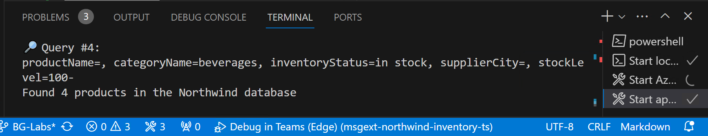

---
lab:
  title: "Exercice\_2\_- Exécuter l’exemple en tant que plug-in Copilot"
  module: 'LAB 02: Build your own message extension plugin with TypeScript (TS) for Microsoft Copilot'
---

# Exercice 2 - Exécuter l’exemple en tant que plug-in Copilot

Dans cet exercice, vous allez exécuter l’application en tant que plug-in pour Microsoft Copilot pour Microsoft 365. Vous allez expérimenter différentes invites et vous observerez comment le plug-in est appelé à l’aide de différents paramètres.

> [!NOTE]  
> Pour effectuer l’exercice suivant, votre compte doit disposer d’une licence valide pour Copilot pour Microsoft 365.

## Tâche 1 - Tester dans Microsoft Copilot pour Microsoft 365 (paramètre unique)

1. Dans le rail d’application à gauche, sélectionnez l’application **Copilot**.

1. Sur le côté droit de la zone de rédaction, sélectionnez l’icône de **plug-in** 1️⃣, puis activez le plug-in **Northwind Inventory** 2️⃣.

    

1. Pour obtenir de meilleurs résultats, sélectionnez l’icône **Nouvelle conversation** en haut à droite avant chaque invite ou ensemble d’invites liées.

    

1. Essayez les invites suivantes qui n’utilisent qu’un seul paramètre de l’extension de message :

    - _Find information about Chai in Northwind Inventory._

    - _Find discounted seafood in Northwind. Show a table with the products, supplier names, average discount rate, and revenue per period._

La dernière doit référencer les documents que vous avez chargés sur OneDrive. À mesure que vous testez, observez les messages de journal dans Visual Studio Code. Vous devriez être en mesure de voir quand Copilot appelle votre plug-in et envoie une requête. Par exemple, après avoir demandé des **fruits de mer à prix réduits**, Copilot a émis cette requête à l’aide de la commande `discountSearch`.


Vous pouvez voir des citations des données Northwind sous 3 formes. S’il existe une référence unique, Copilot peut afficher toute la carte.


S’il existe plusieurs références, Copilot peut afficher un numéro en regard de chacune d’entre elles. Vous pouvez pointer sur ces numéros pour afficher la carte adaptative. Les références seront également répertoriées sous la réponse.


Essayez ces cartes adaptatives pour prendre des mesures sur les produits. Notez que cela n’affecte pas les réponses antérieures de Copilot.

N’hésitez pas à essayer de créer vos propres invites. Vous constaterez qu’elles ne fonctionnent que si Copilot est en mesure d’interroger le plug-in pour obtenir les informations requises. Cela souligne la nécessité d’anticiper les types d’invites que les utilisateurs devront émettre et de fournir les types de requêtes correspondants pour chacune d’entre elles. L’utilisation de plusieurs paramètres rend cette opération plus puissante !

## Tâche 2 - Tester dans Microsoft Copilot pour Microsoft 365 (plusieurs paramètres)

Dans cet exercice, vous allez essayer quelques invites qui exécutent la fonctionnalité à paramètres multiples dans l’exemple de plug-in. Ces invites demanderont des données qui peuvent être récupérées par **name**, **category**, **inventory status**, **supplier city** et **stock level**, comme défini dans le **manifeste de l’application**.

Par exemple, essayez l’invite **_Find Northwind beverages with more than 100 items in stock_**. Pour générer sa réponse, Copilot doit identifier les produits :

- Où la catégorie est **beverages**.
  
  _AND_

- Où le statut de stock est **in stock**.

  _AND_

- Où le **stock level** est supérieur à **100**.

Si vous consultez le fichier journal, vous pouvez voir que Copilot a pu comprendre cette exigence et remplir 3 des paramètres de la première commande d’extension de message.



Le code du plug-in applique les trois filtres, fournissant un jeu de résultats de 4 produits seulement. Copilot utilise les informations sur les cartes adaptatives obtenues et présente un résultat similaire à ceci :


Avec cette invite, Copilot peut également consulter vos fichiers OneDrive pour trouver les conditions de paiement du contrat de chaque fournisseur. Dans ce cas, vous remarquerez que certaines des références n’ont pas l’icône **Northwind Inventory** mais l’icône **Word**.


Voici quelques invites supplémentaires à essayer :

- _Find Northwind dairy products that are low on stock. Show me a table with the product, supplier, units in stock and on order._

- _We’ve been receiving partial orders for Tofu. Find the supplier in Northwind and draft an email summarizing our inventory and reminding them that they should stop sending partial orders per our MOQ policy._

- _Northwind will have a booth at Microsoft Community Days in London. Find products with local suppliers and write a LinkedIn post to promote the booth and products. Emphasize how delicious the products are and encourage people to attend our booth._

- _What beverage is high in demand due to social media that is low stock in Northwind in London. Reference the product details to update stock._

Quelles invites fonctionnent le mieux pour vous ? Essayez de créer vos propres invites et observez vos messages de journal pour voir comment Copilot accède à votre plug-in.

### Conseil de résolution des problèmes

Si vous rencontrez des problèmes lors du test de votre plug-in, vous pouvez activer le **mode développeur**. Le mode développeur fournit des informations sur le plug-in sélectionné par l’orchestrateur Copilot pour répondre à l’invite. Il affiche également les fonctions disponibles dans le plug-in et le code d’état de l’appel d’API.

Pour activer le mode développeur, tapez ce qui suit dans Copilot :

```console
-developer on
```

Exécutez votre invite. Le mode développement génère des résultats semblables à ceci : 


Comme vous pouvez le constater, sous la réponse générée par Copilot, nous avons une table qui nous fournit des informations détaillées sur ce qui s’est passé en arrière-plan :

- Sous **Plug-ins activés**, vous pouvez voir que Copilot a identifié que le plug-in Northwind Inventory est activé.

- Sous **Fonctions correspondantes**, vous pouvez voir que Copilot a déterminé que le plug-in Northwind Inventory offre trois fonctions : `inventorySearch`, `discountSearch` et `companySearch`.

- Sous **Fonctions sélectionnées pour l’exécution**, vous pouvez voir que Copilot a sélectionné la fonction `inventorySearch` pour répondre à l’invite.

- Sous **Détails de l’exécution de la fonction**, vous pouvez voir des informations détaillées sur l’exécution, telles que la réponse HTTP retournée par le plug-in au moteur Copilot.

## Vérifier votre travail

Une fois les tâches effectuées dans cet exercice, vous devez être en mesure d’utiliser le plug-in **Northwind Inventory** dans Copilot pour Microsoft 365. 

Lorsque cet exercice est terminé, vous êtes prêt à ajouter une nouvelle commande à l’extension de message afin de pouvoir développer les fonctionnalités du plug-in et effectuer plus de tâches. 

[Passez à l’exercice suivant…](./5-exercise-3-add-new-command.md)
