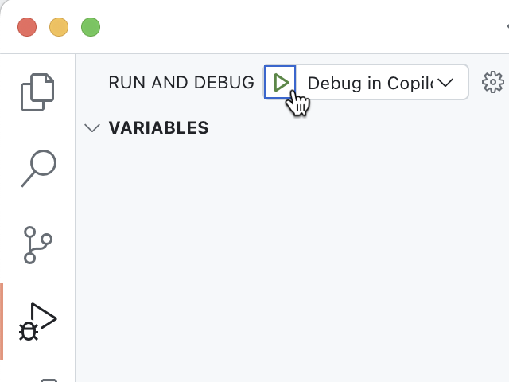
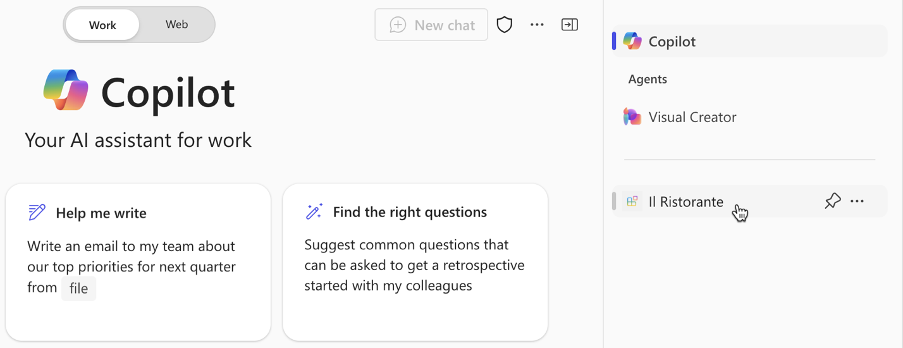
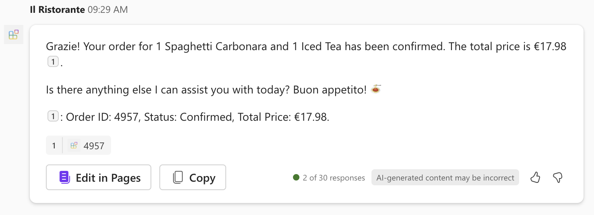

---
lab:
  title: "Exercice\_4\_: tester l’agent déclaratif avec le plug-in d’API dans Microsoft\_365 Copilot"
  module: 'LAB 02: Build your first action for declarative agents with API plugin by using Visual Studio Code'
---

# Exercice 4 : tester l’agent déclaratif avec le plug-in d’API dans Microsoft 365 Copilot

L’extension d’un agent déclaratif avec des actions lui permet de récupérer et de mettre à jour les données stockées dans des systèmes externes en temps réel. À l’aide de plug-ins d’API, vous pouvez vous connecter à des systèmes externes via leurs API pour récupérer et mettre à jour des informations.

### Durée de l’exercice

- **Durée estimée :** 10 minutes

## Tâche 1 : tester l’agent déclaratif

La dernière étape consiste à tester l’agent déclaratif avec le plug-in API dans Microsoft 365 Copilot.

Dans Visual Studio Code :

1. Dans la **barre d’activité**, sélectionnez **Teams Toolkit**.
1. Dans la section **Comptes**, vérifiez que vous êtes connecté à votre locataire Microsoft 365 avec Microsoft 365 Copilot.

  

1. Dans la **barre d’activité**, sélectionnez **Exécuter et déboguer**.
1. Sélectionnez la configuration **Débogage dans Copilot** et démarrez le débogage à l’aide du bouton **Démarrer le débogage**.  

  

1. Visual Studio Code génère et déploie votre projet sur votre locataire Microsoft 365 et ouvre une nouvelle fenêtre de navigateur web.

Dans un navigateur web :

1. Lorsque vous y êtes invité, connectez-vous avec le compte qui appartient à votre locataire Microsoft 365 avec Microsoft 365 Copilot.
1. Dans la barre latérale, sélectionnez **Il Ristorante**.

  

1. Choisissez l’amorce de conversation **Qu’est-ce qu’on mange aujourd’hui ?** et envoyez l’invite.

  

1. Lorsque vous y êtes invité, examinez les données envoyées par l’agent à l’API et confirmez à l’aide du bouton **Autoriser une fois**.

  

1. Attendez que l’agent réponde. Notez que bien qu’il affiche des citations pour les informations qu’il récupère à partir de l’API, la fenêtre contextuelle affiche uniquement le titre du plat. Il n’affiche aucune information supplémentaire, car le plug-in d’API ne définit pas de modèle de carte adaptative.

  

1. Passez une commande en entrant dans la zone de texte d’invite **1x spaghetti, 1x thé glacé** et envoyez l’invite.
1. Examinez les données envoyées par l’agent à l’API et continuez à l’aide du bouton **Confirmer**.

  

1. Attendez que l’agent passe la commande et retourne le résumé de la commande. Là encore, remarquez que l’agent affiche le résumé de la commande en texte brut, car il n’a pas de modèle de carte adaptative.

  

1. Revenez à Visual Studio Code et arrêtez le débogage.
1. Basculez vers l’onglet **Terminal** et fermez tous les terminaux actifs.

  
