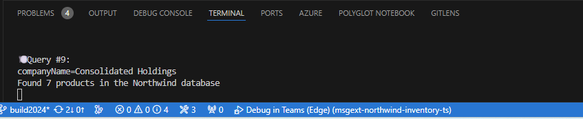

---
lab:
  title: "Exercice\_3\_: ajouter une nouvelle commande"
  module: 'LAB 03: Build your own message extension plugin with TypeScript (TS) for Microsoft Copilot'
---

# Exercice 3 : ajouter une nouvelle commande

Dans cet exercice, vous allez améliorer l’extension de message Teams et le plug-in Copilot en ajoutant une nouvelle commande. Bien que l’extension de message actuelle fournit efficacement des informations sur les produits de la base de données d’inventaire Northwind, elle ne fournit pas d’informations relatives aux clients de Northwind. Vous allez introduire une nouvelle commande associée à un appel d’API qui récupère les produits commandés par un nom de client spécifié par l’utilisateur. Cet exercice nécessite que vous ayez effectué les exercices 1, 2 et 3. Si vous n’avez pas de licence Copilot pour Microsoft 365, vous pouvez ignorer l’exercice 4.

Pour ce faire, nous allons effectuer les tâches suivantes :

1. **Étendez l’interface utilisateur de l’extension de message/du plug-in** en modifiant le manifeste de l’application Teams. Cela inclut l’introduction d’une nouvelle commande : **« companySearch ».** Notez que l’interface utilisateur de l’extension de message est une carte adaptative, tandis que pour Copilot, il s’agit d’une entrée de texte et d’une sortie dans la conversation Copilot.

1. **Créez un gestionnaire pour la commande « companySearch »**. Cela permet d’analyser la chaîne de requête transmise à partir du code de routage des messages, puis de valider l’entrée et d’appeller la recherche de produits par l’API d’entreprise. Cette tâche remplira également une carte adaptative avec la liste de produits retournée, qui sera affichée dans le message ou l’interface utilisateur de la conversation Copilot.

1. Mettez à jour le code de **routage** des commandes pour acheminer la nouvelle commande vers le gestionnaire créé dans la tâche précédente. Pour ce faire, vous allez étendre la méthode appelée par Bot Framework lorsque les utilisateurs interrogent la base de données Northwind (**handleTeamsMessagingExtensionQuery**). 

1. **Implémentez la recherche de produits par entreprise** qui retourne une liste de produits commandés par l’entreprise.

1. **Exécutez l’application** et recherchez des produits achetés par une entreprise spécifiée.

## Tâche 1 : étendre l’interface utilisateur de l’extension/du plug-in de message 

1. Dans Visual Studio Code à partir du **dossier de travail**, ouvrez **manifest.json** et ajoutez le fichier json suivant immédiatement après la commande `discountSearch`. Avec ces informations supplémentaires, vous ajoutez des éléments au tableau `commands` qui définit la liste des commandes prises en charge par le plug-in.

   ```json
   {
       "id": "companySearch",
       "context": [
           "compose",
           "commandBox"
       ],
       "description": "Given a company name, search for products ordered by that company",
       "title": "Customer",
       "type": "query",
       "parameters": [
           {
               "name": "companyName",
               "title": "Company name",
               "description": "The company name to find products ordered by that company",
               "inputType": "text"
           }
       ]
   }
   ```

> [!NOTE] 
> L’**ID** est la connexion entre l’interface utilisateur et le code. Cette valeur est définie comme **COMMAND_ID** dans les fichiers **discount/product/SearchCommand.ts**. Découvrez comment chacun de ces fichiers a une **COMMAND_ID** unique qui correspond à la valeur d’**ID**.

## Tâche 2 : créer un gestionnaire pour la commande « companySearch »

Dans cet exercice, nous allons copier une partie du code existant pour créer de nouveaux gestionnaires pour nos commandes. 

1. Dans Visual Studio Code, copiez « ** productSearchCommand.ts** » et collez-le dans le même dossier pour créer une copie. Renommez ce fichier **customerSearchCommand.ts**.

1. Remplacez la ligne 10 par :

   ```javascript
   const COMMAND_ID = "companySearch";
   ```

1. Remplacez le contenu de **handleTeamsMessagingExtensionQuery** par :

   ```javascript
    {
       let companyName;
   
       // Validate the incoming query, making sure it's the 'companySearch' command
       // The value of the 'companyName' parameter is the company name to search for
       if (query.parameters.length === 1 && query.parameters[0]?.name === "companyName") {
           [companyName] = (query.parameters[0]?.value.split(','));
       } else { 
           companyName = cleanupParam(query.parameters.find((element) => element.name === "companyName")?.value);
       }
       console.log(`🍽️ Query #${++queryCount}:\ncompanyName=${companyName}`);    
   
       const products = await searchProductsByCustomer(companyName);
   
       console.log(`Found ${products.length} products in the Northwind database`)
       const attachments = [];
       products.forEach((product) => {
           const preview = CardFactory.heroCard(product.ProductName,
               `Customer: ${companyName}`, [product.ImageUrl]);
   
           const resultCard = cardHandler.getEditCard(product);
           const attachment = { ...resultCard, preview };
           attachments.push(attachment);
       });
       return {
           composeExtension: {
               type: "result",
               attachmentLayout: "list",
               attachments: attachments,
           },
       };
   }
   ```

> [!NOTE]
> Vous allez implémenter `searchProductsByCustomer` dans la tâche 4.

## Tâche 3 : mettre à jour le routage des commandes

Dans cette tâche, vous allez acheminer la commande `companySearch` vers le gestionnaire que vous avez implémenté dans la tâche précédente.

1. Ouvrez **searchApp.ts**, puis ajoutez le code suivant. Sous cette ligne :

   ```javascript
   import discountedSearchCommand from "./messageExtensions/discountSearchCommand";
   ```

1. Ajoutez cette ligne : 

   ```javascript
   import customerSearchCommand from "./messageExtensions/customerSearchCommand";
   ```

1. Sous cette instruction :

   ```javascript
         case discountedSearchCommand.COMMAND_ID: {
           return discountedSearchCommand.handleTeamsMessagingExtensionQuery(context, query);
         }
   ```

1. Ajoutez cette instruction :

   ```javascript
         case customerSearchCommand.COMMAND_ID: {
           return customerSearchCommand.handleTeamsMessagingExtensionQuery(context, query);
         }
   ```

> [!NOTE]
> L’opération basée sur l’interface utilisateur du plug-in est explicitement appelée. Toutefois, lorsqu’elle est appelée par Microsoft 365 Copilot, la commande est déclenchée par l’orchestrateur de Copilot.

## Tâche 4 : implémenter la recherche de produits par entreprise

Dans cette tâche, vous allez implémenter une recherche de produits **par nom d’entreprise** et retourner une liste des produits commandés par l’entreprise. La sortie de table de la requête se présente comme suit :

| Table         | Rechercher        | Rechercher par    |
| ------------- | ----------- | ------------- |
| Client      | ID client | Nom du client |
| Ordres        | Référence de commande    | ID client   |
| OrderDetail   | Produit     | Référence de commande      |

Voici comment fonctionne la requête : 

1. Utilisez la table **Customer** pour rechercher l’**ID client**avec le **Nom du client**. 

1. Interrogez la table **Orders** avec l’**ID client** pour récupérer les **Référence de commande** associés. 

1. Pour chaque **Référence de commande**, recherchez les produits associés dans la table **OrderDetail**. 

1. Enfin, retournez une liste de produits commandés par le nom de la société spécifié.

Nous allons maintenant modifier le fichier **products.ts** pour ajouter la nouvelle requête de recherche.

1. Ouvrez **.\src\northwindDB\products.ts**.

1. Mettez à jour l’instruction `import` sur la ligne 1 pour inclure OrderDetail, Order et Customer. Cela doit ressembler à ceci :

   ```javascript
   import {
       TABLE_NAME, Product, ProductEx, Supplier, Category, OrderDetail,
       Order, Customer
   } from './model';
   ```

1. Ajoutez la nouvelle fonction `searchProductsByCustomer()`.

   Sous cette ligne :

   ```javascript
   import { getInventoryStatus } from '../adaptiveCards/utils';
   ```

   Ajoutez la fonction  :

   ```javascript
   export async function searchProductsByCustomer(companyName: string): Promise<ProductEx[]> {

       let result = await getAllProductsEx();
   
       let customers = await loadReferenceData<Customer>(TABLE_NAME.CUSTOMER);
       let customerId="";
       for (const c in customers) {
           if (customers[c].CompanyName.toLowerCase().includes(companyName.toLowerCase())) {
               customerId = customers[c].CustomerID;
               break;
           }
       }
       
       if (customerId === "") 
           return [];

       let orders = await loadReferenceData<Order>(TABLE_NAME.ORDER);
       let orderdetails = await loadReferenceData<OrderDetail>(TABLE_NAME.ORDER_DETAIL);
       // build an array orders by customer id
       let customerOrders = [];
       for (const o in orders) {
           if (customerId === orders[o].CustomerID) {
               customerOrders.push(orders[o]);
           }
       }
       
       let customerOrdersDetails = [];
       // build an array order details customerOrders array
       for (const od in orderdetails) {
           for (const co in customerOrders) {
               if (customerOrders[co].OrderID === orderdetails[od].OrderID) {
                   customerOrdersDetails.push(orderdetails[od]);
               }
           }
       }

       // Filter products by the ProductID in the customerOrdersDetails array
       result = result.filter(product => 
           customerOrdersDetails.some(order => order.ProductID === product.ProductID)
       );

       return result;
   }
   ```

## Tâche 5 - Exécuter l’application Rechercher un produit par nom de société

Vous êtes maintenant prêt à tester l’exemple en tant que plug-in pour Copilot pour Microsoft 365.

1. Supprimez l’application **Northwind Inventory** dans Teams. Cette tâche est nécessaire, car vous mettez à jour le manifeste. Les mises à jour de manifeste nécessitent une réinstallation de l’application. Le moyen le plus propre de le faire consiste à le supprimer d’abord de Teams.

    1. Dans la barre latérale Teams, sélectionnez les trois points (...) 1️⃣. Vous devez voir **Northwest Inventory** 2️⃣ dans la liste des applications.

    1. Cliquez avec le bouton droit sur l’icône **Northwind Inventory** et sélectionnez Désinstaller 3️⃣.

        

1. Démarrez l’application dans Visual Studio Code à l’aide du profil **Débogage dans Teams (Edge)** en appuyant sur la touche **F5**.

1. Dans Teams, sélectionnez **Conversation**, puis **Copilot**. Copilot devrait être la première option.

1. Sélectionnez l’**icône de plug-in** et **Northwind Inventory** pour activer le plug-in.

1. Entrez l’invite : 

   ```console
   What are the products ordered by 'Consolidated Holdings' in Northwind Inventory?
   ```

   La sortie du terminal indique que Copilot a compris la requête et exécuté la commande `companySearch`, en transmettant le nom de la société extrait par Copilot.

   

   Voici la sortie dans Copilot :

    

Voici d’autres invites à essayer :

```console
What are the products ordered by 'Consolidated Holdings' in Northwind Inventory? Please list the product name, price and supplier in a table.
```

Bien évidemment, vous pouvez également tester cette nouvelle commande en utilisant l’exemple en tant qu’extension de message, comme nous l’avons fait dans l’exercice précédent. 

1. Dans la barre latérale Teams, accédez à la section **Conversations** et sélectionnez n’importe quelle conversation ou démarrez une nouvelle conversation avec un collègue.

1. Sélectionnez le signe **+** pour accéder au menu Applications.

1. Sélectionnez l’application **Northwind Inventory**.

1. Vous constatez maintenant qu’un nouvel onglet appelé **Customer** s’affiche.

1. Recherchez **Consolidated Holdings** et consultez les produits commandés par cette société. Ils correspondent à ceux que Copilot vous a retournés dans la tâche précédente.

    

## Vérifier votre travail

Une fois l’exercice terminé, vous devez avoir une nouvelle commande pour rechercher des commandes par société dans l’application Northwind Inventory. Vous devez également être en mesure d’utiliser le plug-in avec Copilot et en tant qu'extension de message dans d’autres applications. 

Dans l’exercice suivant, vous allez explorer le code source du plug-in et les cartes adaptatives pour en savoir plus sur la façon dont les applications sont générées et comment les personnaliser davantage.

[Passez à l’exercice suivant…](./6-exercise-4-explore-plugin-source-code.md)