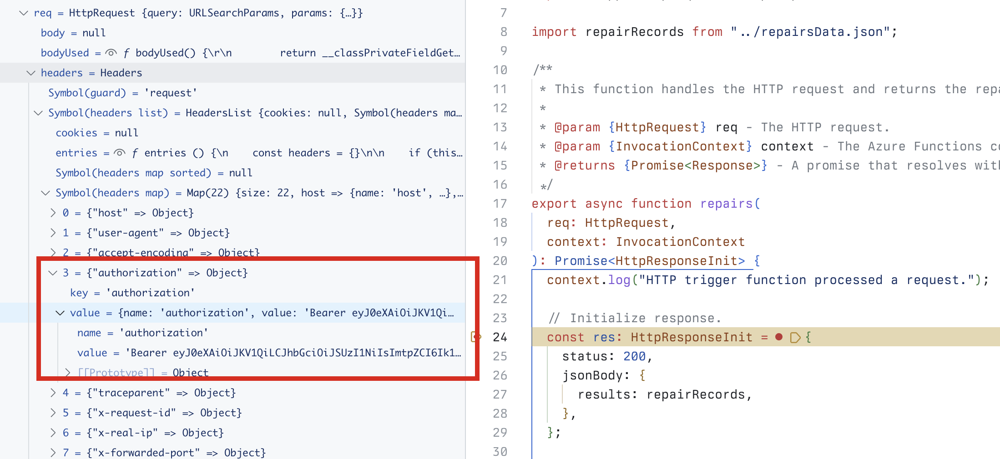

---
lab:
  title: "Exercice\_4\_: tester l’agent déclaratif dans Microsoft\_365 Copilot\_Chat"
  module: 'LAB 05: Authenticate your API plugin for declarative agents with secured APIs'
---

# Exercice 4 : tester l’agent déclaratif dans Microsoft 365 Copilot

Dans cet exercice, vous allez tester et déployer votre agent déclaratif sur Microsoft 365 et le tester à l’aide de Microsoft 365 Copilot Chat.

### Durée de l’exercice

- **Durée estimée :** 5 minutes

## Tâche 1 : tester l’agent déclaratif avec le plug-in d’API dans Microsoft 365 Copilot

La dernière étape consiste à tester l’agent déclaratif avec le plug-in API dans Microsoft 365 Copilot.

Dans Visual Studio Code :

1. Dans la barre d’activité, ouvrez l’extension **Teams Toolkit**.
1. Dans le panneau d’extension **Teams Toolkit**, dans la section **Comptes**, assurez-vous que vous êtes connecté à votre locataire Microsoft 365.

    

1. Dans la barre d’activité, basculez vers la vue **Exécuter et Déboguer**.
1. Dans la liste des configurations, choisissez **Déboguer dans Copilot (Edge)** et appuyez sur le bouton lecture pour démarrer le débogage.

    

    Visual Studio Code ouvre un nouveau navigateur web avec Microsoft 365 Copilot. Si vous y êtes invité, connectez-vous à votre compte Microsoft 365.

Dans un navigateur web :

1. Dans le panneau latéral, sélectionnez l’agent **da-repairs-oauthlocal**.

    

1. Tapez `Show repair records assigned to Karin Blair` dans la zone de texte d’invite, puis envoyez l’invite.

    > [!TIP]
    > Au lieu de taper l’invite, vous pouvez la sélectionner dans les amorces de conversation.

    

1. Vérifiez que vous souhaitez envoyer des données au plug-in d’API à l’aide du bouton **Toujours autoriser**.

    

1. Lorsque vous y êtes invité, connectez-vous à l’API pour continuer à utiliser le même compte que celui que vous utilisez pour vous connecter à votre locataire Microsoft 365, en sélectionnant **Se connecter à da-repairs-oauthlocal**.

    

1. Attendez que l’agent réponde.

    

Même si votre API est accessible de façon anonyme, car elle s’exécute sur votre ordinateur local, Microsoft 365 Copilot appelle votre API authentifiée comme spécifié dans les caractéristiques de l’API. Vous pouvez vérifier que la requête contient un jeton d’accès, en définissant un point d’arrêt dans la fonction de **repairs** et en envoyant une autre invite dans l’agent déclaratif. Lorsque le code atteint votre point d’arrêt, développez la collection req.headers et recherchez l’en-tête d’autorisation qui contient un JSON Web Token (JWT).

Arrêtez la session de débogage dans Visual Studio Code lorsque vous avez terminé le test.
